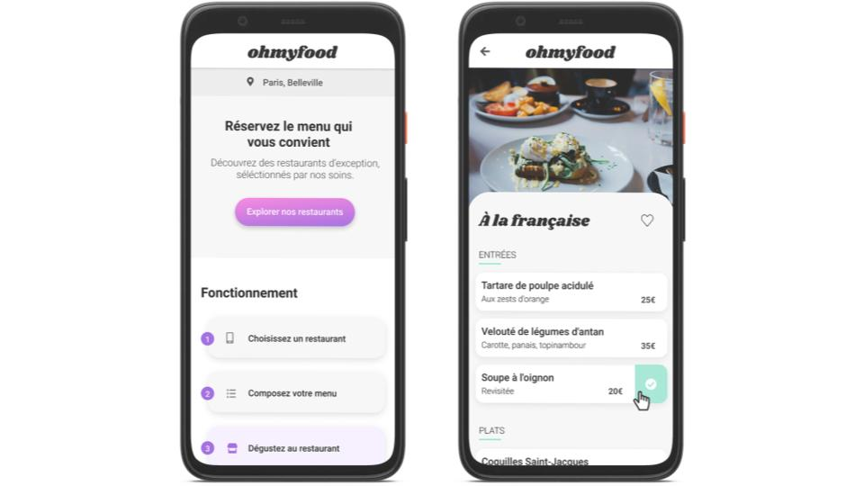

# ohmyfood

## Projet 3 de la formation : Developpeur Web

ohmyfood est un site qui repertorie les menus de restaurants gastronomique.

Dans le cadre de ma formation, je dois réaliser un site 100% mobile.

L'objet de ce projet est l'apprentissage et l'utilisation de SCSS et la création d'annimations avec CSS.

## Page du site

ohmyfood (lien à venir)

## Language

Pour la création de ce site, j'ai utilisé :

    1. HTM5
    2. SCSS

## Rendu final du site

